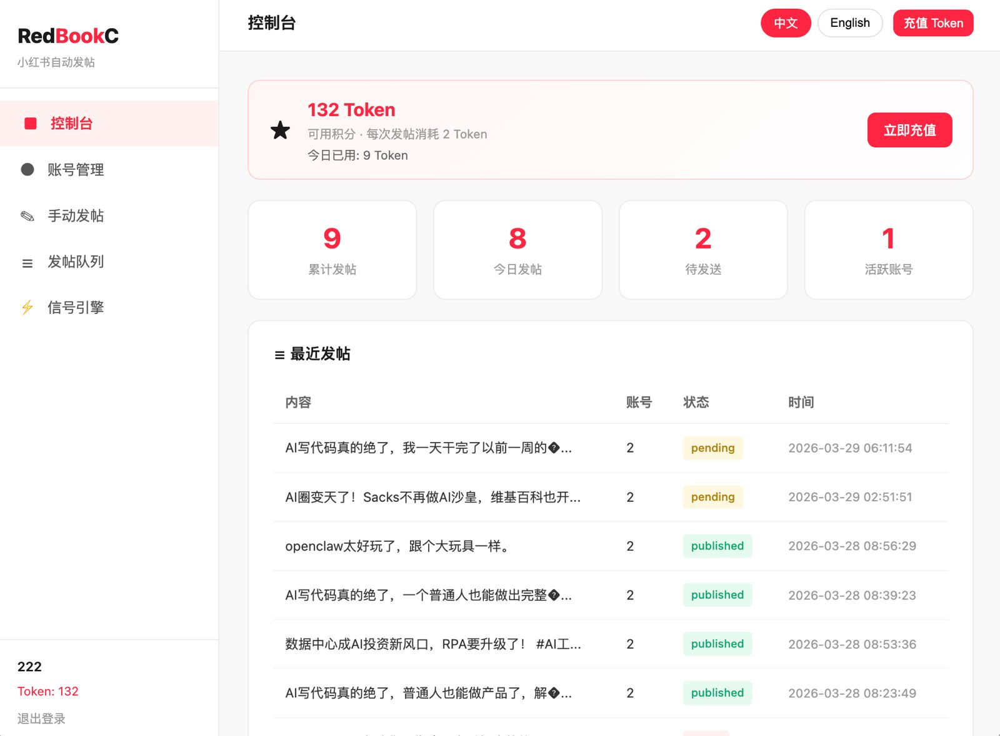
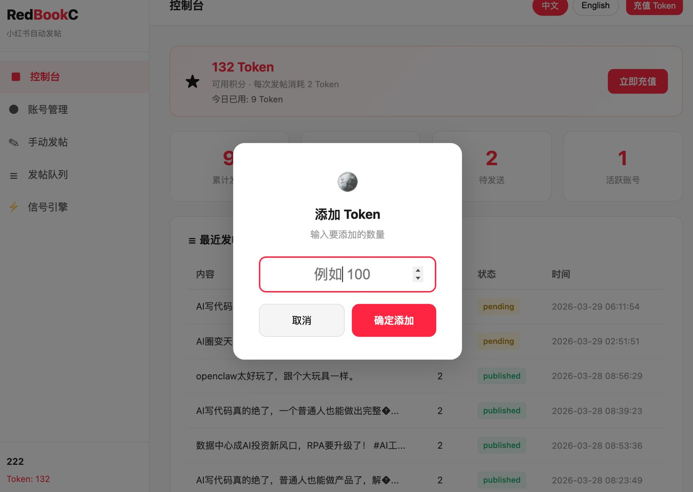
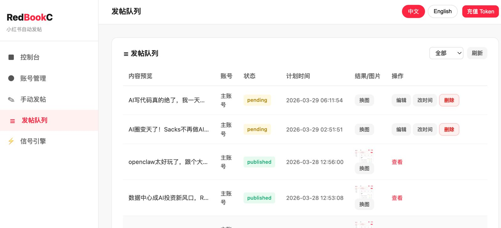
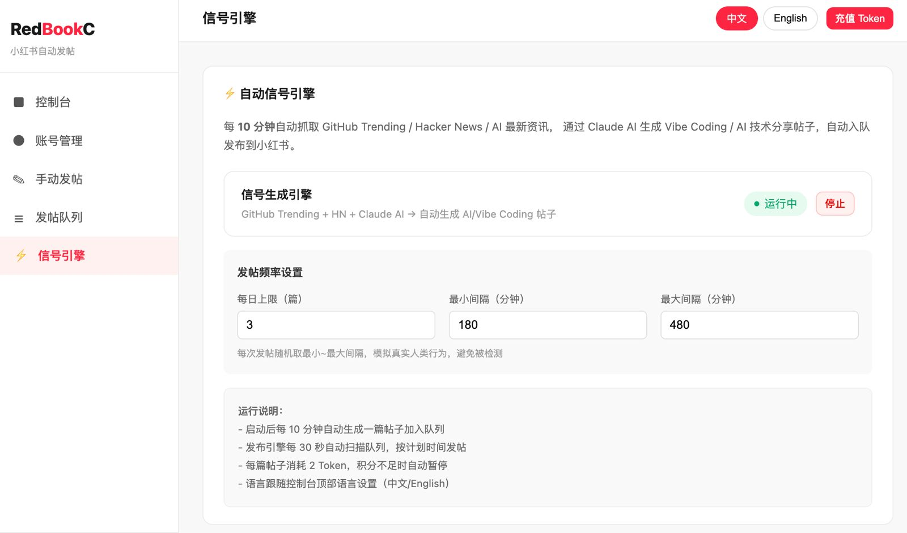

# RedBookC

> 小红书 AI 自动发帖Agent —— 用 Codong 语言构建

## 界面预览

<p align="center">
  
  
</p>
<p align="center">
  
  
</p>

**开源地址：** https://codong.org/redbookc/  
**技术栈：** [Codong](https://codong.org) · Go · SQLite · Playwright · Claude AI

---

## 这是什么

RedBookC 是一个小红书AI全自动运营Agent，在用户自己绑定账号后，全自动生成图片、文字内容，全自动发布内容，让运营者可以彻底脱离双手，全自动在小红书发内容——**不需要手动打开 APP，不需要盯着屏幕**。

### 核心功能

**1. 信号生成引擎（Signal Engine）**  
每 10 分钟自动从 GitHub Trending、Hacker News、AI 科技媒体抓取最新资讯，调用 Claude AI 生成符合小红书风格的短文案（正文不超过 20 个汉字 + 2~3 个话题标签），自动入队。内容主题锁定在 AI 工具、Vibe Coding、OpenClaw，屏蔽加密货币等敏感词。（这个按照个人诉求，可以修改不同锁定主题以及不同的敏感词）

**2. 自动发布引擎（Publisher）**  
每 30 秒扫描发帖队列，到了计划时间就自动用 Playwright 控制 Chrome 浏览器，打开小红书创作者后台，自动完成图片上传（或文字配图生成）、正文填写、点击发布。每个账号独立 Chrome Profile，完全模拟真实用户行为。

**3. 发帖队列管理**  
支持手动添加帖子、修改内容、更换图片、调整发布时间、删除。队列按计划时间排序展示，状态实时更新（pending → published / failed）。

**4. 多账号 + 多用户**  
系统支持多用户注册，每个用户可绑定多个小红书账号，每个账号独立的发帖频率（每日上限、最小/最大间隔），随机化发帖时间模拟真人行为。

**5. Token 积分系统**  
每次发帖消耗 2 Token，积分不足自动暂停。支持充值入口（对接 PayTheFly 加密支付，Webhook 自动到账）。目前没有接入充值Token，后期会加入，目前可以直接前台添加token。

**6. 完整 Web Dashboard**  
纯 Web 界面，手机电脑都能用。包含控制台总览、账号管理、手动发帖、发帖队列、信号引擎配置。

---

## 技术架构

### 整体结构

```
RedBookC
├── src/                    # Codong 源码（核心逻辑）
│   ├── main.cod            # 路由注册、数据库初始化、服务器启动
│   ├── auth.cod            # 用户注册、登录、Session 管理
│   ├── engine.cod          # 信号生成引擎（RSS 抓取 + Claude AI 生成）
│   ├── publisher.cod       # 发布引擎（调用 poster-server）
│   ├── queue.cod           # 发帖队列 CRUD
│   ├── accounts.cod        # 账号管理
│   ├── recharge.cod        # 充值 & Webhook
│   ├── reset.cod           # 每日 Token 重置
│   ├── stats.cod           # 数据统计
│   ├── session.cod         # Session 工具
│   ├── utils.cod           # 公共函数
│   └── dashboard.html      # 前端 Web UI（纯 HTML+JS）
├── poster-server.js        # Node.js Playwright 浏览器自动化服务
├── profiles/               # 小红书账号的 Chrome Profile（含 Cookie）
│   ├── account1/
│   └── account2/
└── uploads/                # 用户上传的图片
```

### 核心数据库（SQLite）

```sql
users         -- 用户表（username, password_hash, tokens）
accounts      -- 小红书账号（profile_dir, daily_post_limit, interval_min/max）
post_queue    -- 发帖队列（content, image_path, status, publish_at）
sessions      -- 登录 Session（token, expires_at）
recharge_pending -- 待充值记录
```

### 技术实现逻辑

**发帖流程（完整链路）：**

```
信号引擎（engine.cod）
  ↓ 每10分钟
  抓取 RSS → Claude AI 生成文案 → INSERT post_queue（status=pending）

发布引擎（publisher.cod）
  ↓ 每30秒扫描
  SELECT * FROM post_queue WHERE status='pending' AND publish_at <= now
  ↓
  调用 poster-server.js（HTTP POST /post）
  ↓
  Playwright 打开 Chrome
  → 导航到 creator.xiaohongshu.com/publish/publish
  → 点击「上传图文」
  → 有图片：setInputFiles → 等待上传 → 填写正文 ProseMirror → 发布
  → 无图片：文字配图 → 输入文案 → 生成图片 → 发布
  ↓
  UPDATE post_queue SET status='published'
```

**Claude 调用（engine.cod）：**

```
HTTP POST https://api.anthropic.com/v1/messages
model: claude-haiku-4-5
prompt: 要求正文≤20汉字，末尾加话题标签，不提加密货币
→ 提取 content[0].text → 安全词过滤 → 入队
```

**随机化发帖间隔：**

```
账号配置：interval_min=180min, interval_max=480min
每次发完后：rand_minutes = min + (timestamp % (max - min))
publish_at = now + rand_minutes
```

---

## 用 Codong 进行二次开发

### 什么是 Codong

[Codong](https://codong.org) 是AI原生的编程语言，语法简洁直观，可以直接编译为 Go 运行，天然支持 Web 服务、数据库、HTTP 请求。RedBookC 的所有业务逻辑都用 Codong 写成，AI 可以直接读懂和修改。这个核心优势主要是大比例节省各大AI的Token。同时代码输出能力极其稳定。

### 推荐开发方式：OpenClaw + Codong

**OpenClaw** 是 AI Agent 运行平台，让他使用 Codong 编辑代码时，可以让你用自然语言驱动 AI 直接修改 `.cod` 文件、编译部署。

```
你说：「帮我在发帖成功后自动发一条微信通知」
AI 做：修改 publisher.cod → 编译 → 部署 → 完成
```

### 本地开发环境搭建

```bash
# 1. 安装 Codong
npm install -g codong   # 或参考 codong.org 安装文档

# 2. 克隆项目
git clone https://github.com/你的用户名/redbookc
cd redbookc/src

# 3. 配置环境变量
cp .env.example .env
# 填写 CLAUDE_API_KEY、DASHBOARD_PORT=8084 等

# 4. 安装 poster-server 依赖
cd ..
npm install

# 5. 启动服务
codong run src/main.cod          # 主服务 :8084
node poster-server.js             # 发帖服务 :8085
```

### Codong 编译部署工作流

由于 Codong 目前版本的特性，生产环境推荐以下流程：

```bash
# 停止服务
systemctl stop redbookc

# Codong 生成 Go 代码（等待 25 秒让临时目录生成）
timeout 28 codong run main.cod &
sleep 25 && kill %1

# 找到生成的 Go 代码目录
TMPDIR=$(ls -td /tmp/codong-run-* | head -1)

# 在这里对 main.go 做必要的补丁（见下方注意事项）

# 编译
go build -o redbookc_src $TMPDIR/

# 重启
systemctl restart redbookc
```

### Codong 二次开发注意事项

在当前版本（Codong 0.1.0）中，有几个已知行为需要注意：

| 问题 | 说明 | 解决方案 |
|------|------|----------|
| `export fn` 里早退限制 | `if cond { return }` 在某些情况下有 bug | 改用 `else` 嵌套结构 |
| `crypto` 模块缺失 | `crypto.random_hex`、`crypto.hmac_sha256` 不存在 | 在 Go 层 patch：`rand.Read` / `hmac.New` |
| `resp.json` 访问 | Codong HTTP 响应的 json 字段需要函数调用形式 | 用 `resp.json()` 而非 `resp.json` |
| `toList(x).Elements...` | 展开参数传入 DB 查询有时失效 | 改为显式传参：`int64(toFloat(uid))` |
| 语法错误无提示跳过 | `.cod` 文件有语法错误时整个文件被跳过，不报错 | 每次改完用 `codong run` 测试是否编译进去 |
| `const` 变量缓存 | `const X = fs.read(file)` 只在启动时执行一次 | 改为在 handler 里每次实时调用 `fs.read()` |

---

## 规避小红书检测的拟人化操作

小红书对自动化发帖有检测机制，以下是我们在 RedBookC 里实现的规避策略：

### 1. 独立 Chrome Profile

每个账号使用独立的 Chrome Profile 目录，保留真实登录的 Cookie 和浏览器指纹。不使用无痕模式，不清空缓存，模拟同一个人一直在用同一台电脑。

### 2. 随机化发帖间隔

**不要固定间隔**（比如每 3 小时发一次）。RedBookC 对每个账号配置最小/最大间隔（默认 3~8 小时），每次随机取中间值：

```
发帖间隔 = random(3小时, 8小时)
```

建议不要设置小于 2 小时的间隔。

### 3. 发帖时间分布

避开凌晨 0~7 点发帖（可在 engine.cod 里加时间判断）。尽量集中在 8~22 点，模拟真人作息。

### 4. 反自动化 JS 注入

poster-server.js 在 Playwright 启动时注入了反检测脚本：

```javascript
Object.defineProperty(navigator, 'webdriver', { get: () => undefined });
Object.defineProperty(navigator, 'plugins', { get: () => [1,2,3,4,5] });
window.chrome = { runtime: {} };
```

### 5. 内容安全过滤

发布前对生成内容做关键词过滤，屏蔽投诉、骗局、维权、加密货币等敏感词，避免因内容触发平台审查导致账号被标记。

### 6. 每日发帖上限

系统强制每个账号有每日发帖上限（默认 3 篇），不要贪多。建议生产环境设置为 2~5 篇/天。

### 7. 操作延迟

每次浏览器操作之间加入随机延迟（2~6 秒），不要连续快速点击，模拟人类阅读和思考的时间。

---

## 如何参与开源共建

### 提交代码

```bash
# 1. Fork 这个仓库

# 2. 创建你的功能分支
git checkout -b feature/你的功能名称

# 3. 在 src/*.cod 文件里做修改
# 注意：业务逻辑改 .cod 文件，不要直接改 main.go

# 4. 本地测试
codong run src/main.cod

# 5. 提交
git add src/你修改的文件.cod
git commit -m "feat: 你的功能描述"

# 6. 发起 Pull Request
```

### 贡献方向

目前最需要帮助的方向：

- 🔧 **更多平台支持** — 抖音、微博、知乎的 poster-server 适配
- 🤖 **更智能的内容** — 接入更多 RSS 源，支持自定义内容主题
- 🌐 **多语言内容** — 英文小红书内容生成
- 📊 **数据看板** — 更丰富的发帖统计和分析
- 🔐 **账号安全** — 登录态自动检测、Cookie 过期提醒
- 💬 **评论互动** — 自动回复评论（需谨慎实现）
- 🧪 **测试覆盖** — Codong 单元测试

### Issue 规范

提 Issue 时请包含：
- 你的 Codong 版本（`codong --version`）
- 操作系统和 Node.js 版本
- 完整的错误日志
- 复现步骤

### 讨论社区

- GitHub Discussions：问题讨论和功能建议

---

## 帮我们录制演示视频 🎬

**如果你会用屏幕录制软件，非常欢迎你录一个演示视频！**

### 需要录制的内容

1. **系统启动**：展示 `codong run main.cod` 启动过程
2. **后台登录**：访问 dashboard，登录账号
3. **引擎启动**：点击「启动」信号引擎，展示状态变为「运行中」
4. **内容入队**：等待或手动添加一条帖子到队列
5. **发布过程**：展示 Playwright 自动控制浏览器在小红书发帖的全过程
6. **队列操作**：展示换图、改时间、编辑内容等功能

### 录制要求

- 分辨率：1080p 或以上
- 格式：MP4
- 时长：建议 3~8 分钟，不需要太长
- 语言：中文解说优先，英文也欢迎
- 字幕：有字幕更好，没有也没关系

### 发布方式

录制完成后请：
1. 上传到 B 站 / YouTube，标题加上 `RedBookC` 关键词
2. 在 GitHub 的 [#视频演示 Discussion](https://github.com) 里贴上链接

**你的视频将会放在这个 README 的最顶部，让更多人看到！** 感谢每一位贡献者。

---

## 部署要求

| 项目 | 要求 |
|------|------|
| 操作系统 | Linux（推荐 Ubuntu 20.04 / CentOS 8+） |
| Node.js | v16+ |
| Go | 1.21+ |
| Codong | 最新版 |
| Playwright | 包含 Chromium |
| 内存 | 最低 2GB（Playwright 跑 Chrome 占内存） |
| 磁盘 | 10GB+（Chrome Profile + 图片存储） |
| Claude API Key | [申请地址](https://console.anthropic.com) |

---

## 许可证

MIT License — 自由使用、修改、商用，保留原始版权声明即可。

---

## 致谢

- [Codong](https://codong.org) — 让 AI 能直接写和改的编程语言
- [OpenClaw](https://openclaw.ai) — AI Agent 运行平台，本项目的开发环境
- [Playwright](https://playwright.dev) — 强大的浏览器自动化框架
- [Claude](https://claude.ai) — 内容生成 AI

---

**⭐ 如果这个项目对你有帮助，点个 Star 支持一下！**
